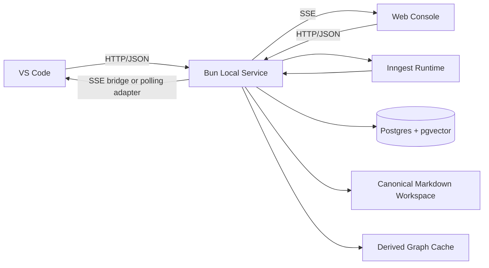

# 01. 系统总览

## 1.1 目标

- 为单作者、多书场景提供一个本地优先的小说创作系统。
- 让长篇科幻网文创作具备可追溯的设定管理、节奏控制和伏笔回收机制。
- 把“无 AI 味”从审美要求落成结构化门禁、评分和可审计的工作流。

## 1.2 非目标

- V1 不做在线多用户协作平台。
- V1 不做完整的发布、运营、订阅和读者反馈闭环。
- V1 不把 Web 端作为正文主编辑器。

## 1.3 V1 硬约束

| 决策项 | V1 结论 |
| --- | --- |
| 主战场 | 本地工作区优先 |
| 真相源 | Markdown 是唯一真相源 |
| 主要使用面 | VS Code 编辑，Web 控制台审批和可视化 |
| 工作流 | Inngest Durable Workflow |
| 服务运行时 | Bun 本地服务 |
| 存储 | Docker Postgres + pgvector |
| 多书策略 | 每本书一个独立工作区、一个本地服务实例、一个独立 schema |
| 主流程并发 | 同一本书所有 canonical 写入共享一条串行 commit lane |
| 实时通道 | HTTP/JSON + SSE，不使用 WebSocket |
| 控制面入口 | Bun CLI 触发命令，Web 控制台负责审批、追踪和图谱 |
| 模型接入 | Provider 抽象，OpenAI 为默认实现 |
| 数据访问 | Prisma 为主，pgvector 相关写入与检索使用原生 SQL 补位 |
| canonical 回流 | 保存即自动 `re-sync-state`；解析失败时继续使用最后一个有效快照 |
| 派生层一致性 | canonical commit 成功后允许图谱/检索短暂最终一致 |

## 1.4 运行拓扑

## 1.5 进程边界

### VS Code

- 编辑 `docs/`、`state/`、`manuscript/`、`prompts/` 下的 canonical 工件。
- 通过终端 / Bun CLI 触发显式命令，例如 `re-sync-state`、`propose chapter-outline`、`export-draft`。
- 不承担主工作流调度责任。

### Web Console

- 展示审批队列、剧情图谱、运行追踪和工件 diff。
- 触发 proposal 类命令和审批类命令。
- 默认作为受信任本地界面，不引入登录系统。

### Bun Local Service

- 提供本地 HTTP API 和 SSE 事件流。
- 负责 canonical Markdown 读写、proposal 持久化、审计记录、graph rebuild、search facade。
- 作为 Inngest 的接入层和领域服务层。

### Inngest

- 负责长流程、可恢复工作流、步骤重试、人工确认前后状态转移。
- 不直接成为 Markdown 真相源。

### Postgres + pgvector

- 保存 proposal、运行审计、摘要索引、图谱派生索引、向量摘要。
- 不允许绕过 Markdown 直接成为 canonical 状态来源。

## 1.6 隔离与并发

- 单作者多书，每本书一个独立工作区。
- 每本书一个本地 Bun 服务实例。
- 每本书在共享 Postgres 实例中使用独立 schema。
- 分析型任务可以并发运行。
- 所有会写入 canonical 状态的提交必须串行，不只限于章节主流程。
- 图谱重建、检索重建和摘要刷新允许在 canonical commit 之后异步追平。

### canonical 回流语义

- canonical 文件每次保存后默认自动进入 `re-sync-state`。
- 连续保存不按“每次保存”单独记账，而是聚合成编辑会话级 synthetic commit。
- 如果某次保存导致 schema 解析失败，工作区进入 `dirty` / `invalid` 状态，运行时继续使用最后一个有效快照。
- 工作区处于 `invalid` 状态时，新的写相关命令必须被阻断；即便 proposal 已获批准，dirty / invalid 工作区也会阻断 canonical commit。

## 1.7 人工确认点

- 世界观大改。
- 分卷大纲。
- 单章细纲。
- 正文落盘前。

单章内部允许 `Drafter -> Reviewer` 自动循环两轮；超过两轮仍未通过，应中断并交给人工或上游提案修正。