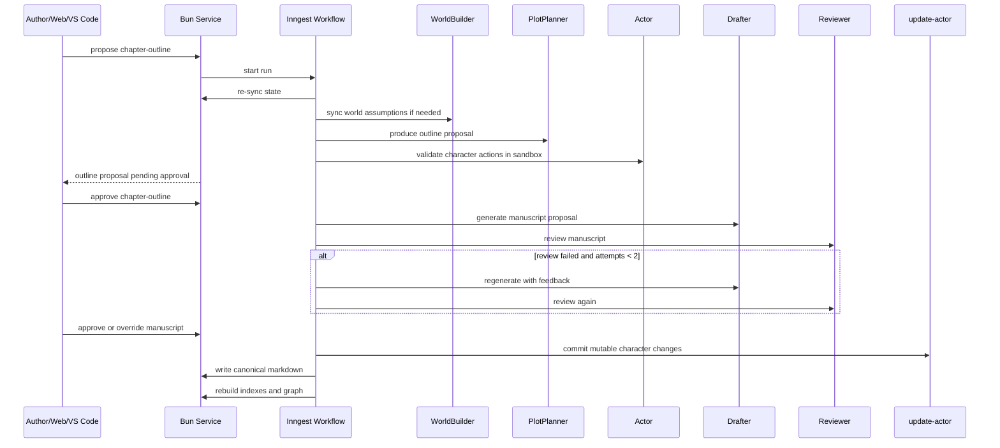

# 04. 工作流与 Agent

## 4.1 主流程概览

以下流程以已初始化书籍为前提。新书与导入先进入 bootstrap 工作流：新书经市场研究、五轮灵感对话、`project-brief`、`world-foundation`、`story-blueprint`、分卷与首批细纲到达 `ready-to-write`；导入经扫描、映射、确认和健康报告到达同一状态。完整状态机与工程边界见 11。

## 4.2 主工作流

### `chapter-outline` proposal

1. `re-sync-state`
2. 校验当前书籍级、卷级状态是否完整。
3. `WorldBuilder` 处理必要的世界设定同步。
4. `PlotPlanner` 生成单章细纲 proposal。
5. `Actor` 在 sandbox 中验证角色行为是否符合现有知识和状态。
6. 进入人工审批。

### `chapter-manuscript` proposal

1. 只读取已审批 outline。
2. 如果目标 outline 仍处于 `pending-review` 或 `pending-approval`，直接返回结构化 `precondition error`，并指出阻塞的 `proposalId`。
3. `Drafter` 生成正文草稿。
4. `Reviewer` 执行规则校验与结构化评分。
5. 如果正文对已审批 outline 发生结构性偏离，必须回到 outline 层修正，而不是直接落盘。
6. 未通过则在两轮内重写。
7. 通过或被 override 后进入 canonical 提交。

### `world-change` proposal

1. `WorldBuilder` 生成影响分析和目标 patch set。
2. Reviewer 检查被影响的聚合、约束冲突和回溯范围。
3. 人工审批的对象是一个不可变 proposal 快照。
4. 批准后不写独立长期 canonical 文档，而是把 patch set 分发到受影响的 `Book`、`Volume`、`Character`、`TechRule`、`Faction`、`Location` 等聚合。

### proposal 分支与 supersede

- 当同一 `artifactType + targetId` 已有活跃 proposal 时，再次发起 `propose` 或 `regenerate`，系统必须创建新的不可变 proposal 快照。
- 被替换的旧 proposal 进入 `superseded`，而不是继续保持多个可竞争的活跃候选。
- 审批仍然按同目标实体线性化处理。

### canonical commit

1. 进入 canonical commit 前，工作区必须处于干净、有效、已追平状态；如果目标文件仍有未追平本地编辑，则直接阻断提交。
2. 写入 `state/chapters/chapter-XXXX-outline.md`。
3. 写入 `manuscript/volume-XXX/chapter-XXXX.md`。
4. `update-actor` 将 sandbox 中的角色宿主可变状态提交到 canonical。
5. 同一 proposal 附带的 `Fact`、`Relationship`、`Resource` 变更通过各自 update artifact 原子提交。
6. 更新 `PlotClue`、`TechRule`、`Faction`、`Location` 相关状态。
7. 上述正文与结构化状态 diff 属于同一次原子 canonical commit，不能拆成事后补写。
8. 触发 graph rebuild 和 search reindex。

如果审批已经完成，但工作区由于 `dirty` / `invalid` 无法安全落盘，proposal 进入 `commit-blocked` / `waiting-sync` 状态；工作区恢复后，系统进入待确认队列，而不是自动继续提交。

## 4.3 Agent 职责边界

| Agent | 主职责 | 默认能力范围 |
| --- | --- | --- |
| WorldBuilder | 世界设定注入、科学边界同步 | 可使用分析型 MCP、结构化检索、向量摘要检索 |
| PlotPlanner | 章纲、卷纲、伏笔调度、章节类型选择 | 可读 graph/search/state，可调用 Actor |
| Actor | 以单角色视角推演行为和解题路径 | 只读角色知识账本、角色状态、相关细纲上下文 |
| update-actor | 回写角色可变状态和知识变化 | 只写角色 mutable fields，提交时机受限 |
| Drafter | 正文生成 | 默认只读已审批上下文，极少工具调用 |
| Reviewer | 审核节奏、质量、门禁、可落盘性 | 可读全量已批准上下文和派生摘要 |

## 4.4 Actor / update-actor 子流程

### Actor

- 作为主流程中的受限子流程参与，而不是独立创作模式。
- 在单章细纲阶段和 Reviewer 角色逻辑复核阶段触发。
- 输出是对细纲的强约束校验输入，而不是可选参考。
- Actor sandbox 采用“最后一个有效 canonical 快照 + 本次运行的 overlay/diff”模型，而不是临时 worktree 或直接改写 canonical 文件。
- proposal 内容、角色可变状态 diff 与附属 update artifact 在审批前默认停留在审计层，只有 canonical commit 才真正回写 Markdown。

### update-actor

- 在细纲阶段只生成 sandbox 状态变化。
- 只有章节正文通过审批并落盘后，才提交 canonical 角色状态变更。
- 允许修改知识、关系、资源、阶段状态，不允许改核心动机和底层人格。
- 共享 `Fact`、`Relationship`、`Resource` 不由 `update-actor` 直接拥有；它们通过独立 update artifact 随主 proposal 原子提交。

## 4.5 人工确认与恢复

### 人工确认点

- 世界观变更。
- 分卷大纲。
- 单章细纲。
- 正文落盘前。

### 恢复动作

- `retry-step`
- `resume-run`
- `abort-run`
- `mark-external-failure`

规则：

- 恢复默认从最近成功步骤继续，而不是整章重跑。
- checkpoint 粒度以业务可见步骤为单位，例如 `re-sync-state`、outline proposal、actor validate、manuscript draft、review、canonical commit、derived rebuild。
- 外部依赖错误要和业务逻辑失败区分开。
- 不允许跳过核心 Agent 继续提交 canonical 状态。
- 作者手工改 canonical 后，`re-sync-state` 也要形成一条可审计的合成提交记录。
- 如果 run 执行期间产生了新的 canonical 快照，所有写相关、会产出 proposal 的活动 run 必须自动中止，并记录 drift 原因；它们不会自动重启。
- bootstrap session 的研究、对话、映射与阶段草稿可恢复或显式丢弃，但在对应 proposal 获批前不是 canonical 状态。

## 4.6 并发规则

- 同一本书所有 canonical 写入共享一条串行 commit lane。
- 图谱重建、摘要重算、提案分析可并发。
- proposal 可以并存，但同类型、同目标实体的新 proposal 会自动 supersede 旧活跃候选，审批与提交仍必须线性化处理。