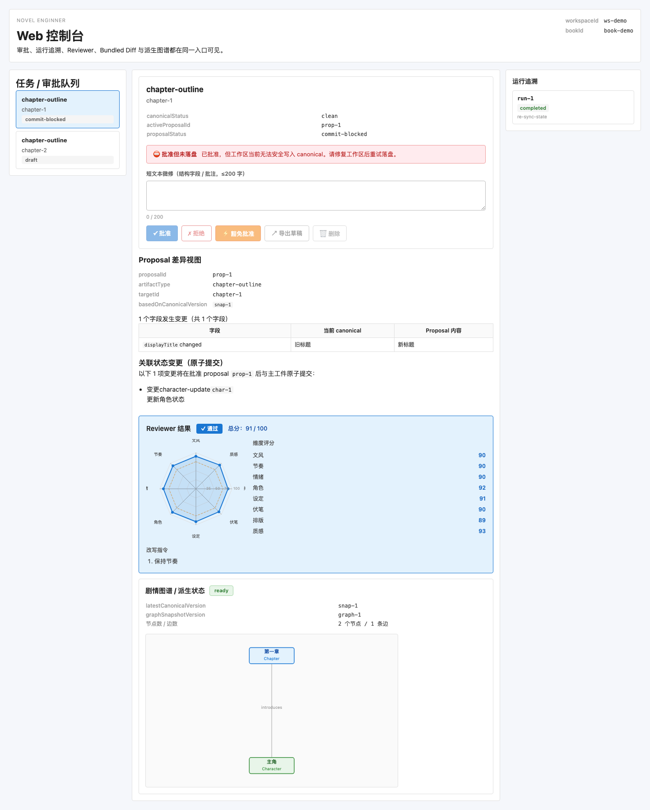
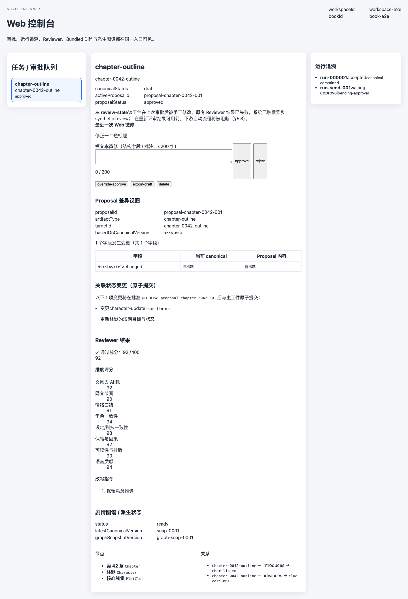

# Novel Enginner 用户使用手册

本文面向作者、编辑和审核者，重点说明“怎么用”，不是“怎么开发”。

## 1. 这是什么

Novel Enginner 是一个本地小说创作控制台。你主要会在 Web 控制台里完成下面几类工作：

- 查看待处理提案
- 审批或驳回提案
- 查看 proposal 与 canonical 的差异
- 查看 Reviewer 评分与改写建议
- 查看关联状态变更（Bundled Diff）
- 查看运行追溯和当前图谱/派生状态

## 2. 打开控制台

当服务已经启动后，在浏览器打开：

```text
http://localhost:3001/app
```

打开后你会看到三个主要区域：

1. 左侧：`任务 / 审批队列`
2. 中间：`工件详情`
3. 右侧：`运行追溯`

下面这张截图展示了系统运行中的控制台总览（演示数据）：



中间详情区会同时显示 proposal 差异、Bundled Diff、Reviewer 结果和剧情图谱/派生状态：


## 3. 控制台里的核心概念

### proposal

proposal 是“等待你审核的提案”。它可能是：

- 世界观变更
- 卷大纲
- 章节细纲
- 正文草稿
- 角色 / 事实 / 关系等状态更新

### canonical

canonical 是已经确认并进入正式状态的内容。未审批的 proposal 默认不会进入 canonical。

### Reviewer

Reviewer 会给出结构化评审结果，包括：

- 是否通过
- 总分
- 各维度评分
- 硬失败项
- 改写建议

### Bundled Diff

有些 proposal 在通过时不只会提交主工件，还会顺带提交关联状态更新。Bundled Diff 就是这批“会一起原子提交”的变更预览。

## 4. 最常见的使用流程

### 流程 A：审批一个提案

1. 在左侧队列中点击目标工件
2. 在中间查看：
   - `proposalStatus`
   - `Proposal 差异视图`
   - `Reviewer 结果`
   - `关联状态变更（原子提交）`
3. 如果需要，在 `短文本微修` 中补充不超过 200 字的微调说明
4. 点击对应动作：
   - `approve`：正常通过
   - `reject`：驳回
   - `override-approve`：带风险审计的强制通过
   - `export-draft`：导出后再人工深改
   - `delete`：丢弃当前提案

下面这张截图展示了完成一次 Web 微修并点击 `approve` 后，系统把 proposal 状态更新为 `approved`，同时把该次手工微修标记为 `review-stale`：



### 流程 B：查看为什么不能继续推进

先看中间详情区和右侧运行追溯区：

- 是否出现 `commit-blocked`
- 是否出现 `waiting-sync`
- 是否出现 `review-stale`
- 右侧是否有失败或中止的运行记录

### 流程 C：看一眼这次审批会顺带改什么

在 `关联状态变更（原子提交）` 中查看：

- 会改哪些实体
- 是新增、修改还是删除
- 每个字段的修改前 / 修改后

这一步特别适合正文 proposal，因为它经常伴随角色、事实、关系等状态更新。

## 5. 页面里每个区域怎么看

## 5.1 任务 / 审批队列

这里展示当前可处理的 proposal。通常你会优先看到：

- 会阻塞主流程的工件
- 重要度更高的工件类型
- 最近更新的工件

如果一个工件很靠前，通常说明它更值得优先处理。

## 5.2 工件详情

这里会展示：

- `canonicalStatus`
- `activeProposalId`
- `proposalStatus`
- 阻断或风险提示
- 最近一次 Web 微修（如果有）

这是你做决策前最先看的区域。

## 5.3 Proposal 差异视图

这里会逐字段显示：

- 当前 canonical
- Proposal 内容
- 哪些字段发生了变化

如果你只想快速判断“这次到底改了什么”，先看这里。

## 5.4 Reviewer 结果

这里能帮助你判断提案质量是否足够：

- 总分是否达标
- 哪些维度偏弱
- 是否有硬失败
- 是否给出改写指令

如果出现硬失败，请先处理失败原因，再决定是否驳回或强制通过。

## 5.5 剧情图谱 / 派生状态

这里展示当前工件关联的：

- 图谱状态
- 当前使用的 canonical 版本
- 派生图谱快照版本
- 关键节点
- 关键关系

如果这里状态不是最新，通常说明派生层还在追平。

## 5.6 运行追溯

这里会列出和当前工件相关的运行记录。你可以快速看到：

- 当前 runId
- 运行状态
- 下一步预期状态

如果页面保持打开，控制台会订阅运行事件并在关键状态变化后自动刷新。

## 6. 五个常见动作的含义

### approve

正常通过该 proposal。

### reject

不接受当前 proposal，需要退回修改。

### override-approve

即使存在某些风险也强制通过，但这类操作应该谨慎使用。

### export-draft

把内容导出后转入人工深改流程。适合长文本或大改动。

### delete

直接丢弃当前 proposal，不再继续处理。

## 7. 三种最重要的状态说明

### commit-blocked

表示“已走到可提交阶段，但现在不能安全落盘”。

常见原因：

- 工作区无效
- 结构校验失败
- 当前 canonical 状态不满足提交条件

### waiting-sync

表示“内容本身可以接受，但还需要等待工作区重新同步或恢复到可提交状态”。

### review-stale

表示“这个工件在上次评审后又被手工修改过，旧的 Reviewer 结果已经不再可靠”。

看到这个状态时，不要直接依赖旧评分做自动推进判断。

## 8. 什么时候该用 Web 微修，什么时候不该用

适合在 Web 里做的：

- 结构字段小改
- 批注补充
- 不超过 200 字的短文本微调

不适合在 Web 里做的：

- 大段正文重写
- 复杂设定重构
- 多章节联动修改

遇到这类情况，优先走 `export-draft` 或回到编辑器处理。

## 9. 常见问题

### 我已经点了 approve，但页面没有进入最终状态

先看：

- `proposalStatus` 是否变成 `waiting-sync` 或 `commit-blocked`
- 右侧运行追溯里是否有失败 / 中止信息

### 为什么我刚改过文本，Reviewer 结果却提示失效

这是正常的。只要工件在评审后被再次手改，系统就会把旧评审标成 `review-stale`。

### 为什么图谱看起来还没更新

图谱和其他派生结果允许稍后追平，不一定和 canonical 提交完全同步。

## 10. 推荐工作习惯

- 先看差异，再看 Reviewer，再决定动作
- 正文 proposal 一定顺手看 Bundled Diff
- 遇到 `review-stale` 时，不要直接依赖旧评分
- 大改动不要硬塞进 Web 微修
- 处理阻断状态时，优先关注 `commit-blocked` 和 `waiting-sync`
